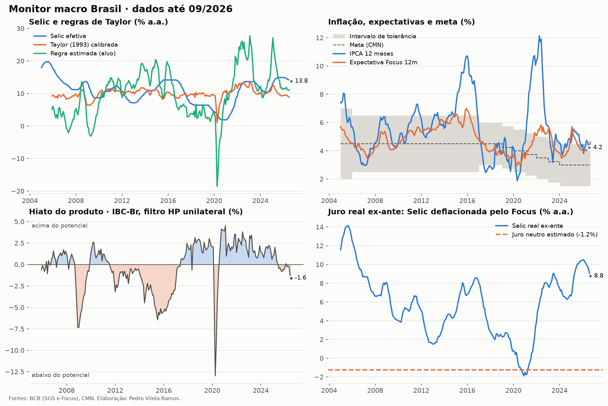

# Relatório do monitor macro

*Gerado automaticamente em 29/09/2026.*

## Últimos números

| Indicador | Valor | Referência |
|---|---:|---:|
| Selic efetiva (% a.a.) | 13.79 | 09/2026 |
| IPCA 12 meses (%) | 4.22 | 08/2026 |
| Expectativa Focus 12m (%) | 4.61 | 09/2026 |
| Meta de inflação (%) | 3.00 | 09/2026 |
| Hiato do produto (%) | -1.58 | 07/2026 |
| Juro real ex-ante (% a.a.) | 8.77 | 09/2026 |
| Taylor (1993) calibrada (% a.a.) | 8.95 | 07/2026 |
| Regra estimada, alvo (% a.a.) | 11.12 | 07/2026 |

## Regra de Taylor estimada

Amostra mensal 2005-12 a 2026-07.
$i_t = c + \rho\, i_{t-1} + a\,\pi^*_t + b\,(E_t\pi_{t+12} - \pi^*_t) + d\,\tilde y_t + \varepsilon_t$

| Variável | Coeficiente | Erro-padrão (HAC) | p-valor |
|---|---:|---:|---:|
| Constante | -0.042 | 0.276 | 0.879 |
| Selic defasada (ρ) | 0.966 | 0.010 | 0.000 |
| Meta de inflação | 0.052 | 0.066 | 0.431 |
| Expectativa − meta | 0.282 | 0.044 | 0.000 |
| Hiato | 0.040 | 0.012 | 0.001 |

R² = 0.994 · N = 248

**Coeficientes de longo prazo**

| Parâmetro | Valor |
|---|---:|
| Suavização ρ | 0.966 |
| Resposta às expectativas φπ | 8.28 |
| Resposta ao hiato φy | 1.17 |
| Juro real neutro implícito (% a.a.) | -1.23 |

Leitura: o juro real ex-ante implícito na regra é
$r_t = i_t - E_t\pi = r^* + (\phi_\pi - 1)(E_t\pi - \pi^*) + \phi_y \tilde y_t$.
O **princípio de Taylor** pede φπ > 1: quando as expectativas sobem, o BC tem de
subir o juro nominal mais que 1 para 1, de modo que o juro **real** também suba.
Estimado aqui: φπ = 8.28 (satisfaz o princípio no longo prazo).

## Curva de Phillips (trimestral)

Amostra 2006Q1 a 2026Q2, com dummies sazonais.
$\pi_t = c + \beta_f E_t\pi_{t+1} + \beta_b\,\pi_{t-1} + \gamma\,\tilde y_{t-1} + \delta\,\Delta e_{t-1} + \varepsilon_t$

| Variável | Coeficiente | Erro-padrão (HAC) | p-valor |
|---|---:|---:|---:|
| Constante | 0.945 | 0.444 | 0.033 |
| Expectativa (βf) | 0.200 | 0.498 | 0.688 |
| Inflação defasada (βb) | 0.376 | 0.144 | 0.009 |
| Hiato defasado (γ) | -0.024 | 0.028 | 0.403 |
| Δ câmbio defasado (δ) | 0.014 | 0.013 | 0.291 |

R² = 0.365 · N = 82

Soma βf + βb = 0.58
(próximo de 1 indica curva vertical no longo prazo).
